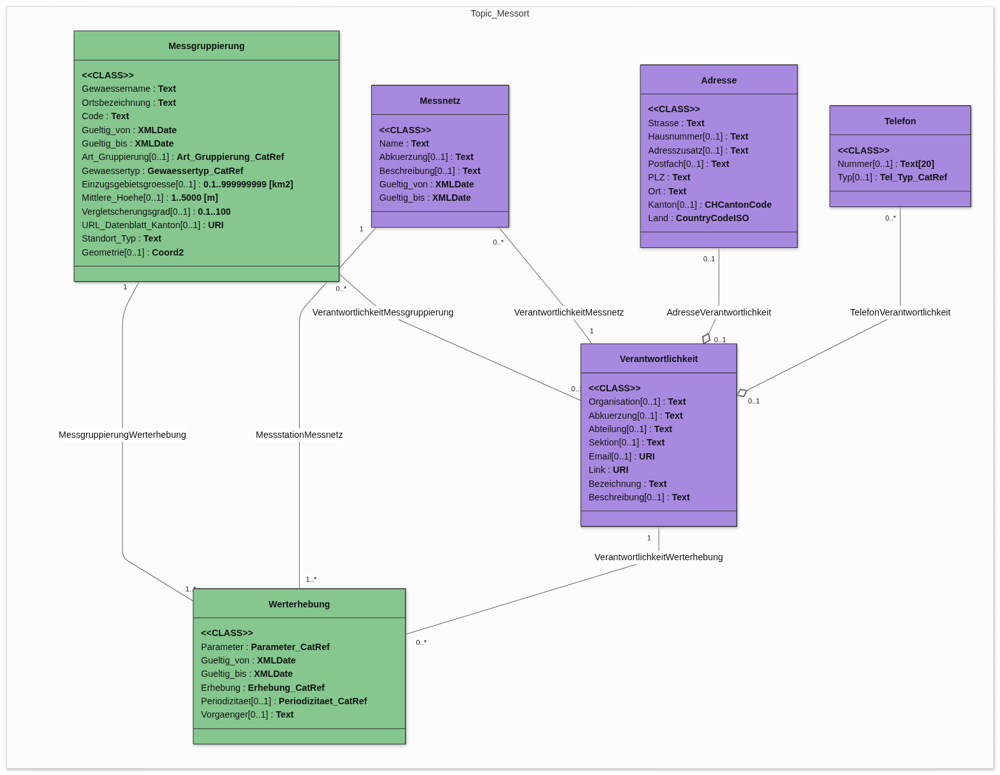
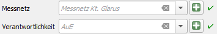

# Produktives Modell Gewässerzustand

Das Modell `prod_gl_gewaesserzustand` soll - analog zum MGDM `Kant_Gewaesserzustand_V1_2` - Messtandorte an den kantonalen Gewässern abbilden.

## Motivation

Grundsätzlich könnte direkt auf dem Datenbankschema welches aus dem MGDM erstellt wurde gearbeitet werden. Aus den folgenden zwei Gründen wurde aber entschieden, dass ein flacheres Produktiv-Modell sinnvoll ist.

**1) Übersicht über Messstandorte intern**: \
Das MGDM zum Thema Gewässerzustand [Kant_Gewaesserzustand_V1_2.ili](model/Kant_Gewaesserzustand_V1_2.ili) favorisiert maximale Flexibilität und minimale Redundanz. Die Objekte der Fachdomäne sind in viele Teil-Objekte unterteilt, welche über Verknüpfungstabellen noch weiter von einander entfernt werden und in der QGIS UI schwer bis unmöglich navigierbar sind.

**2) Datenschnittstelle Externe für Bearbeiter:** \
Als Offerten für Datenaufbereitung eingeholt wurden, war sofort klar, dass externe ihre Daten nicht gemäss dem INTERLIS MGDM abgeben können würden. Es müsste also ohnehin eine flache Struktur vorgegeben werden und ein Prozess (Skript) definiert werden, welche diese Flachen informationen in das MGDM abfüllen kann.

## Grundsätze

Das Produktive Geodatenmodell wurde nach folgenden Grundsätzen erstellt:
- Die Struktur soll vom MGDM abgeleitet werden und möglichst gleich gehalten werden, um den Export möglichst einfach zu gestalten.
  - Es werden keine Attributen aus dem Modell herausgestrichen, sondern ggf. leer gelassen. 
- Die komplexen Beziehungen des MGDM sollen gemäss den simpleren Anforderunengen des Kantonalen Kontexts vereinfacht werden, sodass keine Zwischentabellen nötig sind. Das heisst spezifisch:
  - many-to-many Relationen zu one-to-many Relationen abändern
  - Attributen, welche an Relationen angehängt sind einem Fachobjekt zuweisen.

## Modellbeschreibung

Das [MGDM 134.1](doc/ref/Modelldokumentation_Gewässerzustand_kantonal_v1_2_de_20251222.pdf) wurde für das interne produktiv-Modell nach den oben aufgeführten Grundsätzen in folgende Struktur vereinfacht:
<figure>
  
  <figcaption> UML Darstellung des Produktivmodells.</figcaption>
</figure>

Grün hinterlegt, sind die Klassen, welche hauptsächlich sind für den internen Gebrauch und eigentlich den gesamten Informationsgehalt abbilden.

Violett hinterlegt, sind Klassen, welche vor allem für die Kongruenz zum MGDM gehalten werden. Messnetz und Verantwortung ist für alle gehaltenen Messorte gleich. Das heisst, diese Tabellen müssen nur zu Beginn ein Mal mit dem einen Eintrag des Standardwerts populiert werden. Neue `Messgruppierung` und `Werterhebung` Objekte können von da an automatisch mit diesen Einträgen verknüpft werden. Diese Klassen sind also für den produktiven Gebrauch kaum bemerkbar. Sie haben in dieser Hinsicht hier eine ähnliche Rolle wie Kataloge.

## Hinweise zur Benützung des Datenbankmodells

### QGIS-Projekt
Es wird empfohlen, das Datenbankmodell über QGIS-Projekte zu verwenden, welche mit Model Baker erstellt wurden. So werden sämtliche Beziehungen zwischen den Objekten aufgesetzt und Attributenformulare vorbereitet.\
Weitere Konfigurationen für den handlichen Umgang mit dem Schema wurden im QGIS-Projekt [`prod_gl_gewaesserzustand.qgz`](qgis/prod_gl_gewaesserzustand.qgz) gemacht. Dieses soll als Basissetup dienen, auf dem neue eigene QGIS-Projekte aufgebaut werden können. 

Für den Import in bestehende Projekte wird das Modell am besten frisch über Model Baker importiert. Die zusätzlichen Konfigurationen können anschliessend aus den dem Referenz-Projekt beiliegenden [qml Files](qgis/qml_styles/) geladen werden.
> ℹ️ Mit dem Plugin [Layer Style Loader](https://plugins.qgis.org/plugins/LayerStyleLoader/) kann das ganze Verzeichnis geladen werden. Dazu müssen die Layer ihre standardmässigen Namen wie nach dem Model Baker import haben.

### Erfassen von Messstandorten (Messgruppierungen)

Wie im Kapitel Modellbeschreibung angetönt, sind vor allem die Objekte `Messgruppierung` und `Werterhebung` zu erfassen. Hier einige Bemerkungen dazu:

- Orange hinterlegte Felder werden vom MGDM gefordert und können deshalb nicht leer gelassen werden, damit der Datensatz ins MGDM exportiert werden kann.

- `gueltig_bis=31.12.2999` wird vom MGDM als Standardwert definiert mit der Bedeutung "in Betrieb".

- Code: Hier kann allenfalls ein Code aus der Datenquelle übernommen werden.\
  ⚠️ Eine Konvention für neue Messstandorte ist noch nicht definiert

#### Verknüpfung zu Messnetz und Verantwortlichkeiten

Teil der Vereinfachungen gegenüber dem MGDM 134.1 ist, dass grundsätzlich alle Objekte welche im produktiv-Modell gehalten werden unter der Verantwortlichkeit des Kantons stehen. Deshalb wird in der [Referenz-Konfiguration](qgis/) als Standardwert direkt das Vordefinierte Kantonale Messnetz und die Verantwortlichkeit der Kantonalen Vollzugsstelle ausgefüllt.

Es können jedoch ohne weiteres auch neue Messnetze und Verantwortlichkeiten erfasst und verknüpft werden. Diese können direkt in den respektiven Layern `Messnetz` und `Verantwortlichkeit` hinzugefügt werden und stehen dann in Assoziierten Objekten als Auswahl zur Verfügen.

## Todo

- [ ] Konvention für Feld `Messgruppierung.Code` festlegen.

## Verwandte Themen

Die MGDM Struktur der folgenden Themen ist vergleichbar:
- Grundwasserqualitaet_LV95 (vereinfacht)
- Grundwasserquantitaet_LV95 (vereinfacht)
- Kant_Gewässerzustand_V1_2 (Dieses Thema)
- Hydrologische_Messnetze_V1_1 <> Kant_Hydrologische_Messnetze? 
  - Es muss noch bestätigt werden, welche IDGeoIV genau gefordert sind.

Diese Strukturellen Ähnlichkeiten sollten genutzt werden indem wiederverwendbare Lösungen erstellt werden oder Themen intern zusammengeführt werden.  

